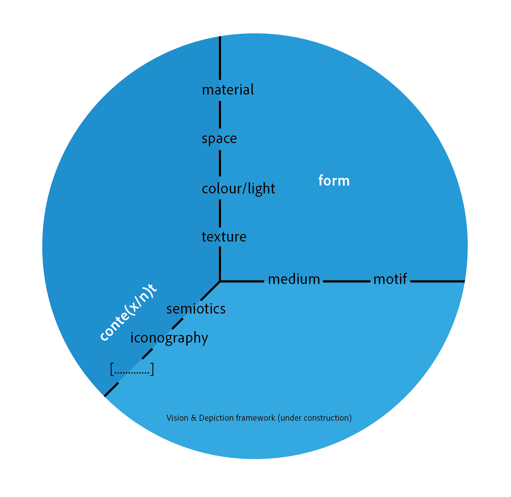

Experimental Formgiving of Visual Information is concerned with doing visual research and giving form to these insights by designing an ‘experiment’, or any another visual design. We will mix and combine a wide variety of design research approaches that all center around visual material. We will not work with a fixed design brief for your assignment, but rather rely on you coming up with a design brief based on your *visual research*.

The course is successor or Visual Communication Design (VCD, ID4230) with which it will next year be combined into the course When Images Remain. If you followed VCD, you were introduced to the Vision and Depiction framework, which outlines how formal elements of pictures related to visual perception. Also, the framework emphasises that formal elements can refer to both medium and motif, i.e. the surface (medium) of a painting can have a certain texture, but so can the mountain that resides in the representation (motif). You can read more about this in our [preprint](https://osf.io/preprints/psyarxiv/geyht).

In this course we will particularly look at image *collections* and relations within these visual corpora. In practice these will be digitised images and we will probably be more interested in motifs than media, but let's keep our options open. Lastly, the framework touches upon some theories concerning the meaning and usage of pictures, such as semiotics and iconography. In essence, it refers to what pictures refer to.

So now you're totally up-to-date with the Vision and Depiction framework, let's dive into the first lecture.
